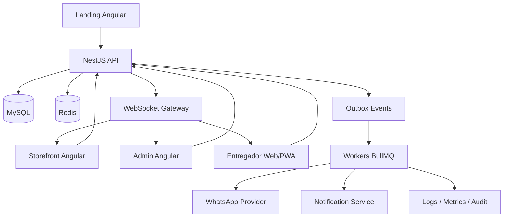
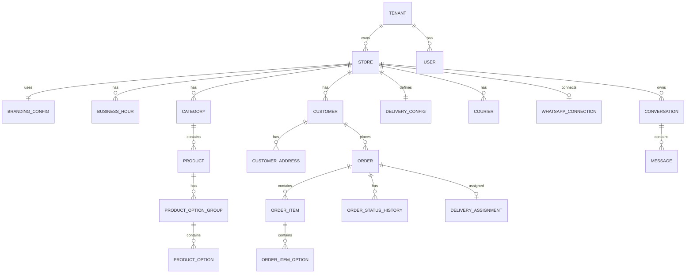
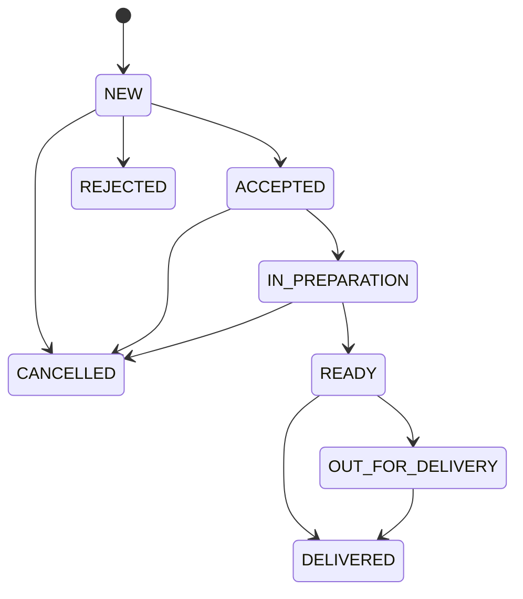

# Especificação Técnica — Plataforma Whitelabel de Delivery

**Status:** Planejamento inicial aprovado  
**Formato:** Documento-base para arquitetura, backlog e entregas incrementais  
**Escopo desta entrega:** Plataforma Web + API + infraestrutura  
**Fora do escopo atual:** Aplicativo Flutter nativo, pagamentos online, fiscal, PDV, mesas/comandas e integrações com marketplaces

---

## 1. Visão do produto

A plataforma será um **SaaS B2B2C multiempresa e whitelabel para operações de delivery**, voltado inicialmente para lanchonetes, pizzarias, restaurantes, hamburguerias e negócios similares.

Cada empresa contratante terá sua própria identidade visual, catálogo, regras de entrega, equipe, clientes, pedidos e canal de WhatsApp. O objetivo é oferecer ao estabelecimento um **canal próprio de vendas**, reduzindo dependência de marketplaces e permitindo relacionamento direto com sua base de clientes.

O sistema deverá suportar:

- landing page institucional da plataforma;
- área administrativa para cada empresa;
- loja/cardápio público do estabelecimento;
- checkout e criação de pedidos;
- acompanhamento de pedidos em tempo real;
- notificações de mudanças de status;
- cadastro e atribuição de entregadores;
- configuração de raio e taxa de entrega;
- integração oficial com WhatsApp;
- evolução posterior para pedidos conversacionais com IA;
- arquitetura preparada para expansão futura de pagamentos e aplicativo móvel.

O posicionamento inicial do produto é:

> **Seu delivery, sua marca, seus clientes — sem comissão por pedido.**

---

## 2. Objetivos de negócio

### 2.1 Objetivo principal

Criar uma plataforma comercialmente utilizável por estabelecimentos locais que desejem operar delivery próprio com custo mensal previsível e sem depender exclusivamente de marketplaces.

### 2.2 Objetivos secundários

- reduzir atrito no processo de pedido;
- permitir operação simples por equipes pequenas;
- oferecer experiência em tempo real ao consumidor;
- centralizar pedidos web e WhatsApp na mesma operação;
- manter histórico de clientes e pedidos por estabelecimento;
- permitir implantação rápida de novos clientes;
- suportar crescimento para múltiplas cidades e regiões;
- criar base técnica para monetização futura por pagamentos, add-ons e aplicativos próprios.

---

## 3. Premissas técnicas obrigatórias

| Camada | Tecnologia |
|---|---|
| Frontend Web | Angular |
| Backend / API | NestJS |
| Banco de dados | MySQL |
| Cache / fila / jobs | Redis + BullMQ |
| Comunicação em tempo real | WebSocket / Socket.IO |
| API pública/interna | REST versionada |
| Documentação de API | OpenAPI / Swagger |
| Arquitetura | Monólito modular |
| Princípios | SOLID, Clean Architecture / Hexagonal quando aplicável |
| Repositório | Monorepo preferencialmente com Nx |
| CI/CD | Pipeline automatizado |
| Infraestrutura | Docker desde o início |
| Aplicativo móvel | Fora da primeira entrega |

---

## 4. Diretrizes arquiteturais

### 4.1 Estratégia geral

A primeira versão deverá ser implementada como **monólito modular**, evitando microserviços prematuros.

Essa escolha deve manter:

- baixo custo operacional;
- menor complexidade de deploy;
- facilidade de desenvolvimento local;
- transações consistentes no banco;
- separação clara entre domínios;
- possibilidade futura de extração de módulos para serviços independentes.

### 4.2 Princípios obrigatórios

A arquitetura deve seguir os seguintes princípios:

- **Single Responsibility Principle**;
- **Open/Closed Principle**;
- **Liskov Substitution Principle**;
- **Interface Segregation Principle**;
- **Dependency Inversion Principle**;
- separação entre domínio, aplicação, infraestrutura e apresentação;
- dependência apontando para o domínio, e não para frameworks;
- uso de interfaces para provedores externos;
- baixo acoplamento entre módulos;
- alta coesão dentro de cada domínio;
- eventos de domínio para efeitos colaterais assíncronos;
- idempotência em operações críticas;
- observabilidade desde a primeira versão comercial.

---

## 5. Arquitetura lógica



---

## 6. Estrutura de aplicações

Estrutura recomendada do monorepo:

```text
/apps
  /landing
  /storefront
  /admin
  /api
  /worker

/libs
  /auth
  /tenancy
  /users
  /stores
  /branding
  /catalog
  /customers
  /orders
  /delivery
  /notifications
  /whatsapp
  /audit
  /shared
```

### 6.1 Responsabilidades

#### `landing`

Site institucional e comercial da plataforma.

#### `storefront`

Loja pública do estabelecimento para navegação, carrinho, checkout e acompanhamento do pedido.

#### `admin`

Painel da empresa para operação diária.

#### `api`

API NestJS responsável por regras de negócio, autenticação, persistência, integrações, WebSocket e contratos públicos.

#### `worker`

Processamento assíncrono de filas, notificações, WhatsApp, retries e tarefas demoradas.

---

## 7. Multi-tenancy

### 7.1 Modelo

O sistema será **multi-tenant desde o primeiro commit**.

Cada empresa contratante será um `Tenant`.

Estrutura conceitual:

```text
Tenant
  └── Store
       ├── Users
       ├── Catalog
       ├── Customers
       ├── Orders
       ├── Couriers
       ├── Delivery Config
       └── WhatsApp Connection
```

### 7.2 Regras obrigatórias

- todas as entidades de negócio devem possuir escopo de tenant;
- consultas devem obrigatoriamente filtrar pelo tenant atual;
- o tenant nunca deve ser confiado a um `tenant_id` arbitrário enviado pelo frontend;
- o tenant deverá ser resolvido por contexto seguro;
- o contexto poderá vir de hostname, subdomínio, domínio personalizado, autenticação ou combinação desses mecanismos;
- nenhuma requisição poderá acessar dados de outro tenant;
- operações administrativas globais serão exclusivas do `SUPER_ADMIN` da plataforma.

### 7.3 Resolução por hostname

Exemplos:

```text
www.plataforma.com.br
painel.plataforma.com.br
pizzariadoze.plataforma.com.br
burgercentral.plataforma.com.br
pedidos.pizzariadoze.com.br
```

---

## 8. Whitelabel

Cada tenant deverá possuir configuração visual própria.

### 8.1 Configurações mínimas

- nome da empresa;
- logotipo;
- favicon;
- cor primária;
- cor secundária;
- cor de destaque;
- capa/banner;
- tipografia opcional;
- telefone;
- WhatsApp;
- endereço;
- redes sociais;
- domínio/subdomínio;
- SEO básico;
- dados de contato;
- horários de funcionamento.

### 8.2 Implementação frontend

Recomenda-se utilização de CSS Custom Properties.

Exemplo:

```css
:root {
  --brand-primary: #000000;
  --brand-secondary: #ffffff;
  --brand-accent: #ff0000;
}
```

As configurações devem ser carregadas dinamicamente conforme o tenant.

---

## 9. Superfícies do produto

### 9.1 Landing institucional

Objetivo: aquisição de estabelecimentos.

Conteúdo mínimo:

- proposta de valor;
- benefícios;
- comparação com marketplaces sem citar promessas juridicamente arriscadas;
- recursos;
- demonstração do fluxo de pedido;
- CTA comercial;
- formulário de contato;
- seção de planos futura;
- FAQ;
- política de privacidade;
- termos de uso.

### 9.2 Storefront do estabelecimento

Funcionalidades:

- visualização do cardápio;
- categorias;
- produtos;
- adicionais e opções;
- variações;
- produtos indisponíveis;
- carrinho;
- endereço de entrega;
- retirada no local;
- cálculo de taxa;
- pedido mínimo;
- observações;
- seleção de forma de pagamento offline;
- finalização de pedido;
- acompanhamento em tempo real;
- recuperação de pedidos por link seguro ou autenticação opcional.

### 9.3 Painel administrativo

Funcionalidades:

- dashboard operacional;
- catálogo;
- categorias;
- produtos;
- adicionais;
- pedidos;
- alteração de status;
- clientes;
- entregadores;
- configurações de entrega;
- horários;
- branding;
- WhatsApp;
- usuários e permissões;
- auditoria;
- relatórios básicos.

### 9.4 Painel do entregador

No MVP será web responsivo / PWA.

Funcionalidades:

- autenticação;
- pedidos atribuídos;
- endereço;
- telefone do cliente conforme permissões;
- status da entrega;
- marcar saída;
- marcar entrega concluída;
- histórico de entregas recentes.

---

## 10. Módulos de domínio

### 10.1 Tenancy

Responsável por:

- tenants;
- status do tenant;
- plano;
- configuração do tenant;
- resolução de tenant;
- isolamento de dados.

### 10.2 Auth

Responsável por:

- login;
- refresh token;
- recuperação de acesso;
- RBAC;
- sessões;
- proteção de rotas;
- política de senha;
- bloqueio por tentativas.

### 10.3 Users

Responsável por:

- usuários administrativos;
- papéis;
- permissões;
- vínculo com tenant.

### 10.4 Stores

Responsável por:

- estabelecimento;
- endereço;
- telefone;
- horários;
- status aberto/fechado;
- pedido mínimo;
- configurações operacionais.

### 10.5 Branding

Responsável por:

- logo;
- cores;
- favicon;
- banners;
- domínio;
- metadados.

### 10.6 Catalog

Responsável por:

- categorias;
- produtos;
- preços;
- imagens;
- disponibilidade;
- grupos de opções;
- adicionais;
- variações;
- ordem de exibição.

### 10.7 Customers

Responsável por:

- cadastro implícito por telefone;
- dados do cliente;
- endereços;
- histórico;
- consentimentos;
- preferências futuras.

### 10.8 Orders

Responsável por:

- carrinho convertido em pedido;
- itens;
- snapshots de preço;
- estados;
- transições;
- histórico;
- totais;
- observações;
- cancelamentos;
- origem do pedido;
- eventos do pedido.

### 10.9 Delivery

Responsável por:

- raio de entrega;
- zonas/faixas;
- taxa;
- entregadores;
- atribuição;
- status da entrega;
- cálculo de distância.

### 10.10 Notifications

Responsável por:

- notificação em tempo real;
- registro de notificações;
- entrega assíncrona;
- retries;
- templates;
- rastreabilidade.

### 10.11 WhatsApp

Responsável por:

- conexão da conta da empresa;
- webhooks;
- mensagens recebidas;
- mensagens enviadas;
- conversas;
- templates;
- handoff humano;
- pedidos originados via WhatsApp;
- integração futura com IA.

### 10.12 Audit

Responsável por registrar ações sensíveis.

Exemplos:

- alteração de preço;
- cancelamento de pedido;
- mudança de status;
- alteração de configurações;
- alteração de permissões;
- login administrativo;
- acesso privilegiado.

---

## 11. Modelo de dados inicial

### 11.1 Entidades centrais

```text
Tenant
Store
BrandingConfig
BusinessHour
User
Role
Permission
Category
Product
ProductOptionGroup
ProductOption
Customer
CustomerAddress
Order
OrderItem
OrderItemOption
OrderStatusHistory
DeliveryConfig
DeliveryZone
Courier
DeliveryAssignment
Notification
WhatsAppConnection
Conversation
Message
OutboxEvent
AuditLog
```

### 11.2 Relacionamentos principais



---

## 12. Snapshot de pedido

Pedidos devem preservar o estado comercial existente no momento da compra.

Nunca depender apenas da referência ao produto atual.

`OrderItem` deve conter pelo menos:

```text
product_id
product_name
sku opcional
unit_price
quantity
notes
options_snapshot
subtotal
```

Isso garante que alterações futuras de preço, nome ou adicionais não afetem pedidos antigos.

---

## 13. Máquina de estados do pedido

Estados mínimos:

```text
NEW
ACCEPTED
IN_PREPARATION
READY
OUT_FOR_DELIVERY
DELIVERED
REJECTED
CANCELLED
```

### 13.1 Fluxo principal



### 13.2 Regras

- toda mudança deve ser validada;
- transições inválidas devem ser rejeitadas;
- toda mudança gera histórico;
- toda mudança relevante gera evento de domínio;
- toda mudança deve registrar autor quando aplicável;
- mudanças externas devem ser idempotentes.

---

## 14. Timeline para o consumidor

Exemplo:

```text
19:32 Pedido realizado
19:34 Pedido aceito
19:36 Em preparação
20:02 Pedido pronto
20:06 Saiu para entrega
20:24 Pedido entregue
```

A timeline será derivada de `OrderStatusHistory`.

---

## 15. Comunicação em tempo real

### 15.1 WebSocket

O WebSocket será utilizado para atualização instantânea das interfaces.

Casos:

- novo pedido no painel;
- mudança de status no storefront;
- atribuição ao entregador;
- atualização da entrega;
- notificações operacionais.

### 15.2 Regra de consistência

O banco de dados é a fonte da verdade.

Sequência correta:

```text
1. Validar transição
2. Persistir mudança no MySQL
3. Criar histórico
4. Registrar evento na outbox
5. Commit da transação
6. Worker processa evento
7. WebSocket / WhatsApp / outros canais recebem atualização
```

Nunca depender de WebSocket como mecanismo de persistência.

---

## 16. Transactional Outbox

Deverá ser utilizado **Transactional Outbox Pattern** para eventos relevantes.

Exemplo de transação:

```text
UPDATE orders
INSERT order_status_history
INSERT outbox_events
COMMIT
```

O worker deve:

- buscar eventos pendentes;
- publicar em fila;
- executar handlers;
- aplicar retry;
- registrar erro;
- marcar evento como processado;
- garantir idempotência.

---

## 17. Redis e BullMQ

Utilizações previstas:

- fila de notificações;
- envio de WhatsApp;
- retries;
- processamento de outbox;
- jobs demorados;
- cache de configurações de tenant;
- rate limit distribuído;
- locks distribuídos quando necessário.

Filas sugeridas:

```text
notifications
whatsapp-outbound
outbox-events
order-events
audit-processing
maintenance
```

---

## 18. API REST

### 18.1 Versionamento

```text
/api/v1
```

### 18.2 Padrões

- JSON;
- DTOs explícitos;
- validação de entrada;
- códigos HTTP corretos;
- paginação padrão;
- filtros;
- ordenação;
- correlation ID;
- erros padronizados;
- Swagger/OpenAPI atualizado.

### 18.3 Rotas indicativas

#### Autenticação

```text
POST   /api/v1/auth/login
POST   /api/v1/auth/refresh
POST   /api/v1/auth/logout
POST   /api/v1/auth/forgot-password
POST   /api/v1/auth/reset-password
```

#### Loja pública

```text
GET    /api/v1/public/store
GET    /api/v1/public/categories
GET    /api/v1/public/products
GET    /api/v1/public/products/:id
POST   /api/v1/public/delivery/quote
POST   /api/v1/public/orders
GET    /api/v1/public/orders/:trackingToken
```

#### Admin — catálogo

```text
GET    /api/v1/admin/categories
POST   /api/v1/admin/categories
PATCH  /api/v1/admin/categories/:id
DELETE /api/v1/admin/categories/:id

GET    /api/v1/admin/products
POST   /api/v1/admin/products
GET    /api/v1/admin/products/:id
PATCH  /api/v1/admin/products/:id
DELETE /api/v1/admin/products/:id
```

#### Admin — pedidos

```text
GET    /api/v1/admin/orders
GET    /api/v1/admin/orders/:id
POST   /api/v1/admin/orders/:id/accept
POST   /api/v1/admin/orders/:id/reject
POST   /api/v1/admin/orders/:id/start-preparation
POST   /api/v1/admin/orders/:id/ready
POST   /api/v1/admin/orders/:id/dispatch
POST   /api/v1/admin/orders/:id/deliver
POST   /api/v1/admin/orders/:id/cancel
```

#### Entregadores

```text
GET    /api/v1/admin/couriers
POST   /api/v1/admin/couriers
PATCH  /api/v1/admin/couriers/:id
POST   /api/v1/admin/orders/:id/assign-courier
```

#### Configuração de entrega

```text
GET    /api/v1/admin/delivery/config
PUT    /api/v1/admin/delivery/config
GET    /api/v1/admin/delivery/zones
POST   /api/v1/admin/delivery/zones
PATCH  /api/v1/admin/delivery/zones/:id
DELETE /api/v1/admin/delivery/zones/:id
```

#### WhatsApp

```text
GET    /api/v1/admin/whatsapp/connection
POST   /api/v1/admin/whatsapp/connect
DELETE /api/v1/admin/whatsapp/connection
GET    /api/v1/admin/whatsapp/conversations
GET    /api/v1/admin/whatsapp/conversations/:id/messages
POST   /api/v1/admin/whatsapp/conversations/:id/messages
POST   /api/v1/webhooks/whatsapp
```

---

## 19. Eventos WebSocket

Eventos sugeridos:

```text
order.created
order.updated
order.accepted
order.rejected
order.in_preparation
order.ready
order.out_for_delivery
order.delivered
order.cancelled
order.courier_assigned
notification.created
conversation.message_received
```

### 19.1 Rooms

Sugestão de rooms:

```text
tenant:{tenantId}
store:{storeId}
order:{orderId}
courier:{courierId}
conversation:{conversationId}
```

O backend deve controlar autorização para entrada em rooms.

---

## 20. Delivery

### 20.1 Regras iniciais

A empresa poderá configurar:

- entrega habilitada/desabilitada;
- retirada habilitada/desabilitada;
- raio máximo;
- pedido mínimo;
- taxa fixa;
- taxa por faixa;
- tempo estimado;
- endereço base da loja.

### 20.2 Faixas de exemplo

```text
0–3 km = R$ 5,00
3–5 km = R$ 7,00
5–8 km = R$ 10,00
```

### 20.3 Distância

No MVP, a elegibilidade poderá ser baseada em distância geográfica utilizando Haversine.

Futuro:

- distância por vias;
- tempo estimado real;
- roteirização;
- múltiplas entregas;
- zonas por polígonos.

---

## 21. Geocodificação

Deverá existir uma abstração:

```typescript
interface GeocodingProvider {
  geocode(address: AddressInput): Promise<Coordinates>;
  reverseGeocode(coords: Coordinates): Promise<AddressResult>;
}
```

O domínio não deve depender diretamente de Google Maps, Mapbox, OpenStreetMap ou qualquer fornecedor específico.

---

## 22. WhatsApp

### 22.1 Diretriz

Utilizar somente integração oficial da WhatsApp Business Platform.

Não utilizar automações baseadas em WhatsApp Web.

### 22.2 Modelo por tenant

Cada estabelecimento deverá operar com seu próprio número e sua própria conexão.

Entidade sugerida:

```text
WhatsAppConnection
- id
- tenant_id
- store_id
- provider
- phone_number
- business_account_id
- phone_number_id
- status
- encrypted_credentials
- connected_at
- disconnected_at
```

### 22.3 Fluxos iniciais

#### Notificações de pedido

- pedido recebido;
- pedido aceito;
- pedido recusado;
- pedido em preparo;
- pedido pronto;
- pedido saiu para entrega;
- pedido entregue;
- pedido cancelado.

#### Atendimento

- receber mensagem;
- abrir conversa;
- responder manualmente;
- transferir entre operadores futuramente;
- vincular conversa a cliente/pedido.

### 22.4 IA — fase posterior

A IA poderá interpretar linguagem natural e chamar ferramentas internas.

Exemplo conceitual:

```text
Cliente: "Quero 2 x-bacon, um sem cebola e uma coca 2L"

IA identifica intenção
    ↓
CatalogSearch
    ↓
ProductOptionResolver
    ↓
CartService
    ↓
DeliveryQuote
    ↓
OrderPreview
    ↓
Cliente confirma
    ↓
OrderService.create()
```

### 22.5 Regra crítica da IA

A IA nunca será fonte da verdade para:

- preço;
- disponibilidade;
- adicionais;
- taxa;
- desconto;
- total;
- status do pedido.

Esses dados devem sempre ser calculados pela aplicação.

### 22.6 Handoff humano

A conversa deverá possuir modos:

```text
BOT
HUMAN
PAUSED
CLOSED
```

O cliente poderá solicitar atendimento humano.

---

## 23. Fluxo do consumidor

Fluxo recomendado:

```text
Cardápio
  ↓
Produto
  ↓
Carrinho
  ↓
Nome + telefone
  ↓
Endereço
  ↓
Cálculo de entrega
  ↓
Forma de pagamento offline
  ↓
Revisão
  ↓
Pedido criado
  ↓
Acompanhamento em tempo real
```

### 23.1 Cadastro

Não exigir criação de conta antes da primeira compra.

O sistema poderá criar ou identificar o cliente por telefone dentro do tenant.

Autenticação por OTP poderá ser adicionada posteriormente.

---

## 24. Formas de pagamento no MVP

Sem integração financeira.

Opções configuráveis:

- dinheiro;
- cartão na entrega;
- PIX manual;
- pagamento na retirada;
- outras formas configuráveis pela empresa.

Para PIX manual, a loja poderá exibir chave e instruções, sem conciliação automática.

---

## 25. Pagamentos futuros

A arquitetura deverá prever abstração:

```typescript
interface PaymentGateway {
  createPayment(input: CreatePaymentInput): Promise<PaymentResult>;
  getPayment(id: string): Promise<PaymentResult>;
  refund(id: string): Promise<RefundResult>;
}
```

Evoluções futuras:

- PIX automático;
- cartão;
- split;
- repasse;
- taxa transacional da plataforma;
- conciliação;
- chargeback;
- reembolso.

---

## 26. Armazenamento de arquivos

Criar abstração:

```typescript
interface StorageProvider {
  upload(file: FileInput): Promise<StoredFile>;
  delete(key: string): Promise<void>;
}
```

Uso:

- imagens de produtos;
- logos;
- banners;
- arquivos futuros.

Produção deverá preferir storage compatível com S3.

---

## 27. Usuários, perfis e permissões

Papéis iniciais:

```text
SUPER_ADMIN
OWNER
MANAGER
ATTENDANT
KITCHEN
COURIER
```

### 27.1 Exemplos de autorização

| Ação | Owner | Manager | Attendant | Kitchen | Courier |
|---|---:|---:|---:|---:|---:|
| Gerenciar usuários | Sim | Opcional | Não | Não | Não |
| Alterar catálogo | Sim | Sim | Opcional | Não | Não |
| Ver pedidos | Sim | Sim | Sim | Sim | Apenas atribuídos |
| Aceitar pedido | Sim | Sim | Sim | Opcional | Não |
| Atualizar preparo | Sim | Sim | Sim | Sim | Não |
| Atribuir entregador | Sim | Sim | Sim | Não | Não |
| Marcar entregue | Sim | Sim | Sim | Não | Sim |
| Configurar loja | Sim | Opcional | Não | Não | Não |

O modelo deve permitir evolução para permissões granulares.

---

## 28. Segurança

### 28.1 Controles mínimos

- JWT de curta duração;
- refresh token seguro;
- hash forte de senha;
- rate limiting;
- bloqueio progressivo de login;
- validação de DTOs;
- sanitização;
- CORS restritivo;
- headers de segurança;
- TLS obrigatório;
- secrets fora do código;
- criptografia de credenciais sensíveis;
- logs de auditoria;
- autorização por tenant;
- proteção contra enumeração de recursos;
- webhooks validados por assinatura quando o provedor suportar;
- proteção contra replay em endpoints sensíveis;
- rotação de segredos;
- backup criptografado.

### 28.2 LGPD

O sistema deve suportar:

- consentimentos separados;
- finalidade operacional vs marketing;
- registro de consentimento;
- exportação futura de dados;
- anonimização/exclusão quando aplicável;
- política de retenção;
- controle de acesso;
- logs de ações administrativas.

---

## 29. Observabilidade

Desde o MVP comercial:

- logs estruturados;
- correlation ID;
- request ID;
- métricas de API;
- tempo de resposta;
- erros por rota;
- jobs com falha;
- taxa de retry;
- eventos não processados;
- saúde do Redis;
- saúde do MySQL;
- conexão com WhatsApp;
- volume de pedidos;
- alertas críticos.

### 29.1 Health checks

Rotas sugeridas:

```text
/health
/health/readiness
/health/liveness
```

---

## 30. Auditoria

Eventos sensíveis devem registrar:

```text
actor_id
actor_type
tenant_id
action
entity_type
entity_id
before
changes
ip
user_agent
created_at
```

Evitar registrar dados sensíveis desnecessários.

---

## 31. Estratégia de frontend Angular

### 31.1 Organização

Preferir organização por domínio/feature.

Exemplo:

```text
src/app
  /core
  /shared
  /features
    /auth
    /catalog
    /orders
    /customers
    /delivery
    /settings
```

### 31.2 Estado

Evitar gerenciamento global excessivo.

Utilizar estado local por feature e adotar store global apenas quando necessário.

### 31.3 UX obrigatória

- responsividade mobile-first;
- skeleton/loading states;
- feedback de ações;
- telas vazias úteis;
- tratamento de erros;
- retry quando aplicável;
- confirmação para ações destrutivas;
- atalhos operacionais no painel de pedidos;
- alertas sonoros configuráveis para novos pedidos.

---

## 32. Painel de pedidos

O painel operacional deve ser uma das telas mais rápidas do sistema.

Sugestão de colunas:

```text
Novos
Aceitos
Em preparo
Prontos
Saiu para entrega
Finalizados
```

Pode evoluir para Kanban, mas o MVP deve priorizar velocidade operacional.

Um novo pedido deve:

- aparecer sem recarregar a tela;
- emitir alerta visual;
- opcionalmente emitir alerta sonoro;
- mostrar tempo desde a criação;
- permitir aceitar/rejeitar rapidamente.

---

## 33. Entregadores

Cadastro mínimo:

```text
name
phone
status
active
vehicle_type opcional
notes opcional
```

### 33.1 Atribuição

No MVP, atribuição manual.

Fluxo:

```text
Pedido READY
  ↓
Operador escolhe entregador
  ↓
DeliveryAssignment criado
  ↓
Entregador recebe atualização
  ↓
Marca saída
  ↓
Marca entregue
```

Futuro:

- autoatribuição;
- disponibilidade;
- localização em tempo real;
- roteirização;
- múltiplas entregas.

---

## 34. Relatórios do MVP

Relatórios básicos:

- pedidos por período;
- faturamento informado pelos pedidos;
- ticket médio;
- pedidos por status;
- pedidos cancelados;
- clientes recorrentes;
- produtos mais vendidos;
- origem do pedido;
- entregas concluídas por entregador.

Não criar BI complexo na primeira entrega.

---

## 35. Performance

Diretrizes:

- índices compostos incluindo `tenant_id` quando adequado;
- paginação obrigatória em listagens grandes;
- evitar N+1 queries;
- cache de configurações estáveis;
- imagens otimizadas;
- lazy loading no Angular;
- compressão HTTP;
- CDN para assets em produção;
- queries monitoradas;
- conexão com banco via pool.

---

## 36. Índices recomendados

Exemplos:

```text
orders(tenant_id, status, created_at)
orders(tenant_id, customer_id, created_at)
products(tenant_id, category_id, active)
customers(tenant_id, phone)
delivery_assignments(tenant_id, courier_id, status)
messages(tenant_id, conversation_id, created_at)
outbox_events(status, created_at)
```

---

## 37. Idempotência

Obrigatória em:

- criação de pedido via integração externa;
- webhooks de WhatsApp;
- callbacks futuros de pagamento;
- processamento de outbox;
- jobs de notificação;
- alterações críticas originadas por sistemas externos.

---

## 38. Convenções de API

### 38.1 Erro padrão

```json
{
  "error": {
    "code": "ORDER_INVALID_TRANSITION",
    "message": "The requested order transition is not allowed",
    "details": null,
    "requestId": "..."
  }
}
```

### 38.2 Paginação

```text
?page=1&pageSize=20
```

Resposta:

```json
{
  "data": [],
  "meta": {
    "page": 1,
    "pageSize": 20,
    "total": 0,
    "totalPages": 0
  }
}
```

---

## 39. OpenAPI e geração de clientes

A especificação OpenAPI da API deverá ser utilizada para:

- documentação;
- contratos;
- testes;
- geração de clientes TypeScript;
- futura geração de cliente Dart.

Evitar duplicação manual de modelos entre frontend e backend sempre que possível.

---

## 40. Testes

### 40.1 Pirâmide

#### Unitários

Obrigatórios nos domínios críticos:

- OrderStateMachine;
- cálculo de entrega;
- preços;
- adicionais;
- permissões;
- tenancy;
- idempotência.

#### Integração

- repositórios;
- banco;
- filas;
- outbox;
- autenticação;
- APIs principais.

#### E2E

Fluxos obrigatórios:

```text
Cliente realiza pedido
Restaurante recebe
Restaurante aceita
Pedido entra em preparo
Pedido fica pronto
Entregador é atribuído
Pedido sai para entrega
Pedido é entregue
Cliente acompanha todas as etapas
```

Também:

- pedido rejeitado;
- pedido cancelado;
- endereço fora do raio;
- produto indisponível;
- tentativa de acesso cross-tenant.

---

## 41. Infraestrutura

### 41.1 Ambientes

```text
local
development
staging
production
```

### 41.2 Docker

Serviços locais:

```text
api
worker
mysql
redis
admin
storefront
landing
```

### 41.3 Produção

A infraestrutura deverá permitir:

- containers independentes para API e worker;
- banco gerenciado preferencialmente;
- Redis gerenciado preferencialmente;
- storage compatível com S3;
- reverse proxy;
- TLS;
- backup automatizado;
- monitoramento;
- escalabilidade horizontal da API e workers.

---

## 42. CI/CD

Pipeline mínimo:

```text
lint
  ↓
typecheck
  ↓
unit tests
  ↓
integration tests
  ↓
build
  ↓
security checks
  ↓
container build
  ↓
deploy staging
  ↓
smoke tests
  ↓
deploy production
```

Produção deve possuir mecanismo de rollback.

---

## 43. Banco e migrations

- migrations versionadas;
- nunca alterar schema manualmente em produção;
- migrations backward-compatible quando possível;
- backup antes de mudanças destrutivas;
- seed apenas para dados de desenvolvimento;
- plano de rollback por migration crítica.

---

## 44. Backups

Requisitos mínimos:

- backup automatizado do banco;
- retenção configurável;
- cópia fora do servidor principal;
- teste periódico de restauração;
- documentação de recovery.

---

## 45. Escopo do MVP comercial

### Incluído

- multi-tenancy;
- whitelabel;
- landing page;
- painel administrativo;
- storefront;
- catálogo;
- categorias;
- produtos;
- adicionais;
- pedidos;
- timeline;
- WebSocket;
- clientes;
- endereços;
- raio de entrega;
- taxa de entrega;
- retirada;
- pedido mínimo;
- entregadores;
- atribuição manual;
- painel web do entregador;
- WhatsApp oficial para notificações;
- estrutura de conversas;
- RBAC;
- auditoria;
- relatórios básicos;
- observabilidade;
- CI/CD;
- backups.

### Excluído

- Flutter;
- pagamento online;
- split financeiro;
- fiscal;
- PDV;
- estoque completo;
- mesas/comandas;
- cashback;
- fidelidade;
- marketplace;
- roteirização avançada;
- tracking GPS contínuo;
- integração iFood/99;
- ERP;
- emissão fiscal;
- IA autônoma para pedidos em produção sem supervisão inicial.

---

# 46. Fases entregáveis

A especificação deverá poder ser quebrada nas fases abaixo.

## Fase 0 — Fundação técnica

### Objetivo

Criar a base reutilizável e segura do produto.

### Entregáveis

- monorepo;
- apps base;
- Docker;
- MySQL;
- Redis;
- CI;
- estrutura NestJS;
- estrutura Angular;
- configurações por ambiente;
- logging;
- health checks;
- migrations;
- padrões de erro;
- Swagger;
- lint e testes.

### Critério de aceite

Todas as aplicações sobem localmente e em staging com pipeline automatizado.

---

## Fase 1 — Multi-tenancy, autenticação e whitelabel

### Objetivo

Permitir cadastrar empresas e acessar ambientes isolados.

### Entregáveis

- Tenant;
- Store;
- usuários;
- papéis;
- login;
- refresh token;
- isolamento de tenant;
- branding;
- subdomínio;
- horários;
- configurações básicas.

### Critério de aceite

Duas empresas podem operar simultaneamente sem visualizar dados uma da outra e com identidade visual distinta.

---

## Fase 2 — Catálogo e storefront

### Objetivo

Permitir que o consumidor visualize e monte um pedido.

### Entregáveis

- categorias;
- produtos;
- imagens;
- adicionais;
- variações;
- disponibilidade;
- cardápio público;
- carrinho;
- fechamento da loja por horário;
- pedido mínimo.

### Critério de aceite

Consumidor consegue montar um carrinho válido com produtos e adicionais de uma loja.

---

## Fase 3 — Checkout, clientes e pedidos

### Objetivo

Fechar o ciclo de criação de pedido.

### Entregáveis

- cliente por telefone;
- endereços;
- checkout;
- entrega/retirada;
- formas de pagamento offline;
- criação do pedido;
- snapshot de itens;
- state machine;
- histórico;
- link de acompanhamento.

### Critério de aceite

Consumidor realiza um pedido completo sem cadastro obrigatório e consegue consultá-lo depois.

---

## Fase 4 — Operação em tempo real

### Objetivo

Transformar o sistema em ferramenta operacional do estabelecimento.

### Entregáveis

- painel de pedidos;
- WebSocket;
- alerta de novo pedido;
- aceite/recusa;
- preparo;
- pronto;
- cancelamento;
- timeline em tempo real;
- outbox;
- BullMQ;
- retries.

### Critério de aceite

Um pedido criado no storefront aparece no painel sem refresh e cada mudança de status aparece ao consumidor em tempo real.

---

## Fase 5 — Delivery e entregadores

### Objetivo

Gerenciar a etapa física da entrega.

### Entregáveis

- configuração de raio;
- taxa fixa;
- taxa por faixa;
- Haversine;
- validação de endereço;
- entregadores;
- atribuição manual;
- painel do entregador;
- saída para entrega;
- entrega concluída.

### Critério de aceite

O sistema bloqueia pedidos fora da área permitida e permite concluir todo o ciclo até a entrega.

---

## Fase 6 — WhatsApp operacional

### Objetivo

Centralizar notificações e comunicação no número do estabelecimento.

### Entregáveis

- conexão WhatsApp por tenant;
- webhook;
- envio de mensagens;
- templates;
- notificações de pedido;
- conversas;
- mensagens;
- atendimento manual;
- logs e retries.

### Critério de aceite

Cliente recebe as notificações definidas e o estabelecimento consegue visualizar e responder conversas integradas.

---

## Fase 7 — Administração, auditoria e relatórios

### Objetivo

Preparar a plataforma para uso comercial recorrente.

### Entregáveis

- dashboard;
- relatórios básicos;
- auditoria;
- gestão de usuários;
- permissões;
- métricas operacionais;
- telas de configuração;
- melhorias de UX;
- monitoramento;
- alertas.

### Critério de aceite

A empresa consegue operar o negócio diariamente sem depender de acesso técnico ao sistema.

---

## Fase 8 — Piloto comercial

### Objetivo

Validar o produto com operações reais.

### Entregáveis

- onboarding assistido;
- checklist de implantação;
- importação inicial de catálogo quando necessário;
- treinamento;
- suporte;
- telemetria;
- coleta de feedback;
- correções;
- hardening.

### Critério de aceite

Ao menos um estabelecimento opera pedidos reais durante período acordado sem falhas bloqueadoras.

---

## Fase 9 — IA no WhatsApp

### Objetivo

Permitir pedidos conversacionais sem comprometer segurança comercial.

### Entregáveis

- intent detection;
- ferramentas de catálogo;
- montagem de carrinho;
- cálculo de entrega;
- confirmação explícita;
- criação de pedido;
- handoff humano;
- limites e guardrails;
- métricas de confiança;
- revisão operacional.

### Critério de aceite

Pedidos simples podem ser montados pela conversa, mas preço, disponibilidade e criação continuam sendo validados pelo backend.

---

## Fase 10 — Expansões futuras

Possíveis linhas de evolução:

- pagamentos online;
- PIX automático;
- cartão;
- split;
- taxa transacional;
- fidelidade;
- cupons;
- CRM;
- campanhas;
- estoque;
- PDV;
- KDS;
- fiscal;
- roteirização;
- geolocalização de entregador;
- integração com ERPs;
- integração com marketplaces;
- aplicativo Flutter;
- múltiplas lojas por tenant;
- franquias;
- marketplace próprio opcional.

---

# 47. Priorização MoSCoW do MVP

## Must Have

- tenant;
- login;
- RBAC;
- whitelabel;
- catálogo;
- checkout;
- pedido;
- state machine;
- painel de pedidos;
- WebSocket;
- clientes;
- delivery;
- entregadores;
- WhatsApp de status;
- auditoria mínima;
- observabilidade;
- backup.

## Should Have

- relatórios básicos;
- domínio personalizado;
- faixas de entrega;
- PWA do entregador;
- atendimento WhatsApp integrado;
- alertas sonoros;
- exportações simples.

## Could Have

- cupons;
- agendamento de pedidos;
- produtos favoritos;
- OTP de cliente;
- impressão automática;
- analytics mais avançado.

## Won't Have Now

- Flutter;
- pagamento online;
- fiscal;
- PDV;
- estoque completo;
- roteirização avançada;
- marketplace;
- IA autônoma sem supervisão.

---

## 48. Definition of Done

Uma funcionalidade só deve ser considerada concluída quando:

- regra de negócio implementada;
- autorização implementada;
- isolamento de tenant validado;
- tratamento de erro implementado;
- logs adequados;
- testes relevantes;
- migration quando necessária;
- documentação atualizada;
- API documentada;
- UI responsiva quando aplicável;
- revisão de código;
- pipeline verde;
- deploy em staging;
- critério de aceite validado.

---

## 49. Definition of Ready

Uma história está pronta para desenvolvimento quando possuir:

- objetivo claro;
- descrição;
- regra de negócio;
- critério de aceite;
- dependências conhecidas;
- impacto em API conhecido;
- impacto em banco conhecido;
- impacto em tenant conhecido;
- fluxo de erro previsto.

---

## 50. Requisitos não funcionais

### Disponibilidade

O sistema deve ser planejado para operação diária contínua, com manutenção controlada.

### Escalabilidade

API e workers devem permitir escala horizontal.

### Segurança

Isolamento de tenants é requisito crítico e bloqueador de release.

### Performance

Operações principais do painel devem permanecer rápidas mesmo com crescimento de pedidos.

### Auditabilidade

Mudanças críticas devem possuir histórico.

### Recuperação

Backup e restauração devem ser testáveis.

### Evolução

Integrações externas devem ser abstraídas por interfaces.

---

## 51. Riscos técnicos principais

### 51.1 Vazamento cross-tenant

**Impacto:** crítico.  
**Mitigação:** tenant context obrigatório, testes de isolamento, code review específico e índices corretos.

### 51.2 Perda de notificações

**Impacto:** alto.  
**Mitigação:** outbox + fila + retry + idempotência.

### 51.3 Dependência excessiva de WhatsApp

**Impacto:** médio/alto.  
**Mitigação:** integração desacoplada via provider, logs e fallback pela própria plataforma.

### 51.4 Complexidade prematura

**Impacto:** alto.  
**Mitigação:** monólito modular, MVP enxuto e bloqueio de escopo.

### 51.5 Endereço incorreto / geocodificação

**Impacto:** médio.  
**Mitigação:** confirmação visual/textual do endereço e abstração de geocoding.

### 51.6 Pedidos duplicados

**Impacto:** alto.  
**Mitigação:** idempotency key e proteção de duplo submit.

---

## 52. Critérios de sucesso do primeiro release comercial

O primeiro release será considerado utilizável quando um estabelecimento real conseguir, sem intervenção técnica diária:

1. configurar sua marca;
2. cadastrar produtos;
3. abrir o cardápio público;
4. receber pedidos;
5. aceitar ou rejeitar pedidos;
6. atualizar preparação;
7. atribuir entregador;
8. concluir entrega;
9. manter o consumidor informado;
10. consultar clientes e histórico;
11. receber notificações via WhatsApp configuradas;
12. operar com isolamento completo de outros tenants.

---

## 53. Estratégia comercial suportada pela arquitetura

A arquitetura deverá suportar inicialmente:

- taxa de implantação;
- mensalidade;
- planos diferentes;
- add-ons futuros;
- WhatsApp como add-on ou franquia;
- domínio personalizado;
- múltiplos níveis de recursos;
- suspensão de tenant por inadimplência;
- trial futuro, se desejado.

Entidades futuras previstas:

```text
Plan
Subscription
PlanFeature
TenantFeature
UsageMetric
InvoiceReference
```

Nenhuma cobrança financeira precisa ser implementada no MVP.

---

## 54. Onboarding de novo estabelecimento

Checklist sugerido:

```text
[ ] Criar tenant
[ ] Criar store
[ ] Configurar branding
[ ] Configurar domínio/subdomínio
[ ] Configurar endereço
[ ] Configurar horários
[ ] Configurar raio/taxas
[ ] Criar usuário owner
[ ] Cadastrar/importar categorias
[ ] Cadastrar/importar produtos
[ ] Conectar WhatsApp
[ ] Cadastrar entregadores
[ ] Realizar pedido de teste
[ ] Validar notificações
[ ] Treinar equipe
[ ] Publicar loja
```

Esse processo poderá ser automatizado progressivamente.

---

## 55. Roadmap técnico resumido

```text
Fundação
  ↓
Multi-tenancy + Auth
  ↓
Whitelabel
  ↓
Catálogo
  ↓
Storefront
  ↓
Checkout + Pedidos
  ↓
Tempo real
  ↓
Delivery
  ↓
WhatsApp
  ↓
Relatórios + Hardening
  ↓
Piloto comercial
  ↓
IA no WhatsApp
  ↓
Pagamentos / Flutter / expansões
```

---

## 56. Decisões arquiteturais consolidadas

1. Angular é obrigatório para aplicações web.
2. NestJS é obrigatório para a API.
3. MySQL é o banco relacional principal.
4. Redis + BullMQ serão usados para jobs e filas.
5. WebSocket será utilizado para atualizações em tempo real.
6. O sistema será multi-tenant desde o início.
7. O whitelabel será dirigido por configuração e não por forks de código.
8. O backend será monólito modular.
9. Eventos assíncronos utilizarão Transactional Outbox.
10. Integrações externas usarão interfaces/adapters.
11. O consumidor não será obrigado a criar conta antes de pedir.
12. O banco é a fonte da verdade para estados de pedido.
13. WhatsApp será integrado somente por meios oficiais.
14. A IA não poderá determinar valores comerciais.
15. Flutter fica fora desta entrega.
16. Pagamentos online ficam fora desta entrega.
17. O MVP deve priorizar o ciclo completo do pedido e a operação diária.

---

## 57. Próximo passo recomendado

A partir deste documento, o próximo nível de detalhamento deve ser dividido em artefatos executáveis:

```text
1. ADRs — Architecture Decision Records
2. Modelo físico do banco
3. Contratos OpenAPI
4. Matriz completa de permissões
5. Eventos de domínio
6. Eventos WebSocket
7. Backlog por épicos
8. User stories
9. Critérios de aceite por história
10. Plano de releases
11. Estratégia de deploy
12. Checklist de segurança
```

Cada **Fase Entregável** deste documento pode ser convertida diretamente em um milestone de projeto.

---

## 58. Conclusão

A primeira versão do produto deve ser **enxuta, vendável e operacionalmente completa**.

O foco não é reproduzir todas as funcionalidades de plataformas maduras, mas executar excepcionalmente bem o fluxo principal:

```text
cliente encontra a loja
  ↓
faz o pedido
  ↓
empresa recebe imediatamente
  ↓
aceita e produz
  ↓
atribui entrega
  ↓
cliente acompanha
  ↓
pedido é entregue
  ↓
histórico fica registrado
```

Esse núcleo deverá ser construído de forma robusta o suficiente para suportar expansão futura sem exigir reescrita estrutural da aplicação.

